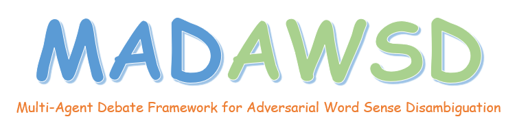
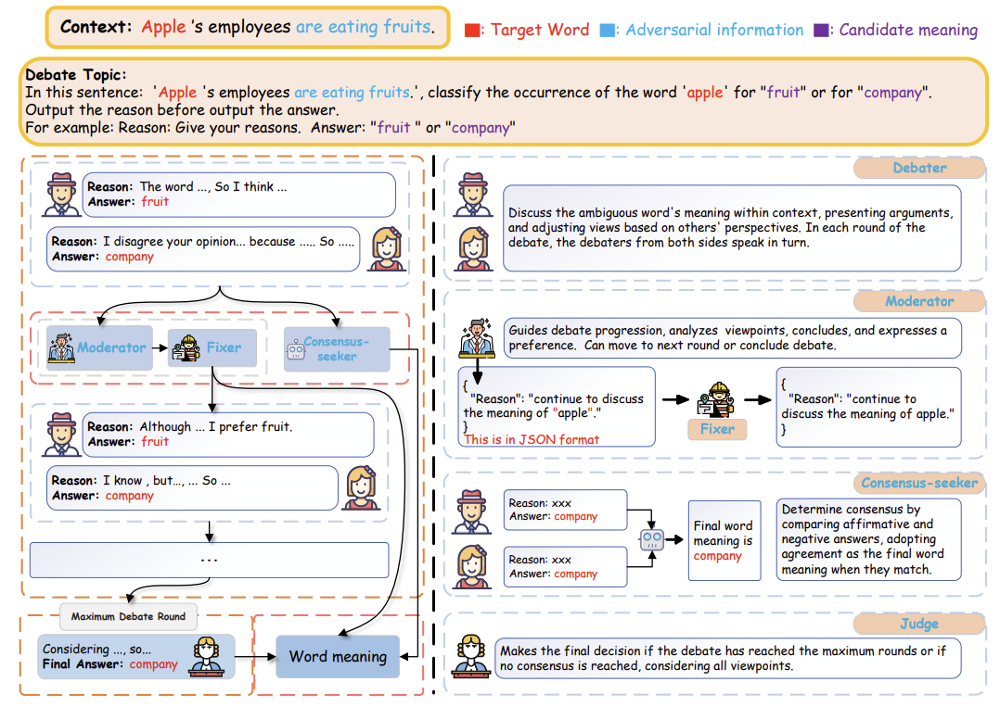
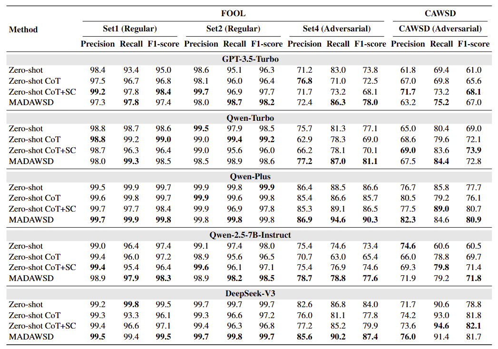

# MADAWSD
The **MADAWSD** framework simulates a real-world debate environment where multiple agent roles — namely, the **Debater**, **Moderator**, **Consensus-seeker**, and **Judge** — engage in discussions about ambiguous words in the context of adversarial information. Through a collaborative mechanism among these agents, it achieves accurate WSD.

## Architecture


## Datasets
To comprehensively evaluate the **MADAWSD** framework, we conduct extensive experiments on two challenging datasets: the **FOOL** dataset and our self-constructed **CAWSD** dataset. 

Statistics of datasets

| Dataset  | #Word   |#Sentence| #Adversarial |
|----------|---------|---------|--------------|
| Set1 (FOOL) | 20   | 1810    | No           |
| Set2 (FOOL) | 20   | 1810    | Yes          |
| Set4 (FOOL) | 20   | 1019    | Yes          |
| CAWSD       | 20   | 1000    | Yes          |

## How to use
1. Install dependencies
   
   ```shell
   pip install -r requirement.txt
   ```

    + Set your openai `API_KEY` in `MADAWSD_FOOL.py`
    + Set your openai `API_KEY` in `MADAWSD_CAWSD.py`


2. Directly run the examples provided in `MADAWSD_FOOL.py` or `MADAWSD_CAWSD.py`

   ```shell
   python MADAWSD_FOOL.py
   ```

## Overall Performance
Our experimental results are presented as shown in the following table.


## Acknowledgement
We drew inspiration from [MAD](https://github.com/Skytliang/Multi-Agents-Debate) and [MedAgents](https://github.com/gersteinlab/MedAgents) to introduce our MADAWSD, and we sincerely thank the authors of [MAD](https://github.com/Skytliang/Multi-Agents-Debate) and [MedAgents](https://github.com/gersteinlab/MedAgents).
Parts of the code are modified from [MAD](https://github.com/Skytliang/Multi-Agents-Debate). We appreciate the authors for making [MAD](https://github.com/Skytliang/Multi-Agents-Debate) open-sourced.

## Reference

+ MAD: [Encouraging Divergent Thinking in Large Language Models through Multi-Agent Debate](https://aclanthology.org/2024.emnlp-main.992/) (EMNLP2024)
+ MedAgents: [Encouraging Divergent Thinking in Large Language Models through Multi-Agent Debate](https://aclanthology.org/2024.findings-acl.33/) (ACL2024 Findings)